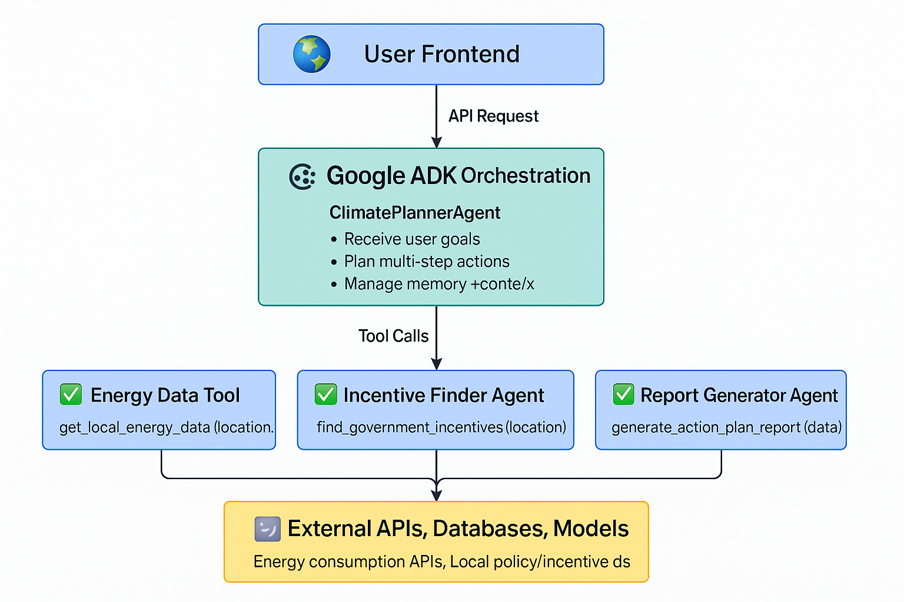

# 🌍 Climate Action Planner

This is a Streamlit app designed to help users create a **personalized carbon reduction plan** based on their location, energy usage, and carbon reduction goals.

---

## 🚀 Features

✅ Generate a carbon reduction action plan  
✅ Estimate monthly energy (kWh) reduction targets  
✅ Calculate expected CO₂ emissions savings  
✅ Provide local incentives and recommendations  
✅ Easy-to-use Streamlit interface  
✅ **Sidebar About page** with project info and links

---

## 🏗 Architecture



### How it works:
1. **User Inputs:** Location, target reduction %, and duration.
2. **Energy Data:** App fetches average energy consumption.
3. **Carbon Calculation:** Uses external API or local function to estimate emissions.
4. **Action Plan Generation:** A planning agent (`ClimatePlannerAgent`) creates a custom plan.
5. **Results Display:** The plan summary, detailed breakdown, and incentives are shown.

---

## 🔧 Setup & Run

### Prerequisites
- Python 3.8+
- Virtual environment (recommended)

### Install dependencies

```bash
git clone https://github.com/sabirAIE/AI-Driven-Climate-Action-Planner.git
cd climate_action_planner
python -m venv .venv
source .venv/bin/activate  # or `.venv\Scripts\activate` on Windows
pip install -r requirements.txt
```
### Run the Streamlit app
```commandline
streamlit run streamlit_app.py
```

### Directory structure
```commandline
climate_action_planner/
├── agents/
│   ├── climate_planner_agent.py
│   ├── incentive_finder_agent.py
│   └── report_generator_agent.py
├── tools/
│   ├── energy_data_tool.py
│   └── carbon_estimator_tool.py
├── external/
│   ├── energy_api.py
│   ├── carbon_api.py
│   └── incentive_api.py
├── streamlit_app.py
├── requirements.txt
└── README.md
```

## DATA References and APIs

### Climatiq Data Coverage
**Carbon Footprint Estimation: Climatiq API.**
**Co2 Estimate**: https://www.climatiq.io/data
### Energy Consumption: Central Electricity Authority (CEA) of India.
**ALL India Electricity Generation Data API:**
https://cea.nic.in/api-for-central-electricity-authority-data/?lang=en
### Govt Scheme
**Government Incentives: Pradhan Mantri Surya Ghar Muft Bijli Yojana and PM E-DRIVE schemes.**

